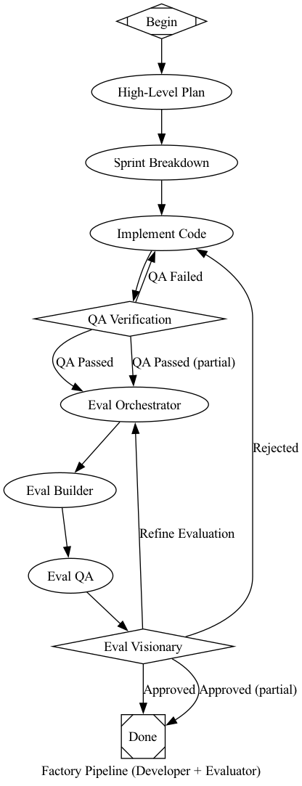
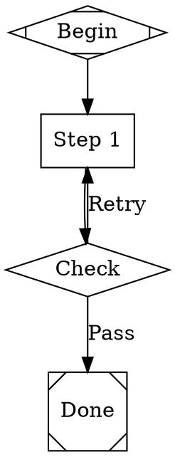

# attractor-go

A Go pipeline engine that runs multi-stage AI workflows defined as Graphviz DOT graphs. Nodes are tasks, edges are transitions with conditions and weights, and the engine handles traversal, retries, checkpointing, and context management.

## Quick start

```go
// Run a single pipeline from DOT source
runner := engine.NewRunner(registry)
outcome, err := runner.RunDOT(ctx, dotSource, "/path/to/logs")

// Run the factory (developer + evaluator with context isolation)
f := &factory.FactoryRunner{
    Registry:      registry,
    MaxRejections: 3,
}
outcome, err := f.RunWithGoal(ctx, "build a feature", "/path/to/logs")
```

## Core concepts

**Graph**: A directed graph parsed from DOT syntax. Nodes have attributes (`shape`, `type`, `prompt`, `goal_gate`, `max_retries`). Edges have attributes (`condition`, `weight`, `label`, `loop_restart`).

**Handler**: Executes a node. Implements `Execute(ctx, node, pctx, graph, logsRoot) (*Outcome, error)`. The registry maps node types to handlers:

| Shape | Type | Handler | Purpose |
|-------|------|---------|---------|
| `Mdiamond` | `start` | StartHandler | Pipeline entry, no-op |
| `Msquare` | `exit` | ExitHandler | Pipeline exit, no-op |
| `box` | `codergen` | CodergenHandler | LLM code generation |
| `hexagon` | `wait.human` | WaitForHumanHandler | Human gate |
| `diamond` | `conditional` | ConditionalHandler | Routing point, no-op |
| `component` | `parallel` | ParallelHandler | Concurrent fan-out |
| `tripleoctagon` | `parallel.fan_in` | FanInHandler | Aggregate parallel results |
| `parallelogram` | `tool` | ToolHandler | Shell command execution |
| `house` | `stack.manager_loop` | StackManagerLoopHandler | Loop counter |
| `doubleoctagon` | `communication` | CommunicationHandler | Inter-pipeline boundary |

**Context** (`state.Context`): Thread-safe key-value store shared across nodes within a single pipeline run. `Set(key, value)`, `Get(key)`, `Snapshot()`, `Clone()`, `Clear()`.

**Outcome** (`state.Outcome`): Returned by handlers. Contains `Status` (success/fail/retry/partial_success), `ContextUpdates`, `PreferredLabel`, `SuggestedNextIDs`, `FailureReason`.

**Edge selection**: After each node, the engine picks the next edge in strict priority: (1) condition match against outcome/context, (2) preferred label, (3) suggested next IDs, (4) highest weight, (5) lexical tiebreak.

## Pipeline execution lifecycle

```
DOT source → Parse → Transform → Validate → Execute → Checkpoint
```

1. **Parse** — DOT text → `*graph.Graph` with nodes, edges, attributes
2. **Transform** — Variable expansion (`$goal`), stylesheet application
3. **Validate** — 13 lint rules (start/exit nodes exist, reachability, condition syntax, retry targets)
4. **Execute** — Walk nodes start→exit, run handlers, select edges, retry on failure
5. **Checkpoint** — Atomic save after each node for crash recovery

Each `RunDOT` call creates a **fresh** `state.Context`. Graph attributes are mirrored in, then `InitialContext` (if set) is applied. No state carries over between separate `RunDOT` calls.

## Factory pipeline

`FactoryRunner` runs `developer.dot` and `evaluator.dot` as separate, context-isolated pipelines:

```
FactoryRunner.RunWithGoal(goal)
  │
  for each iteration (up to MaxRejections):
  │
  ├─ RunDOT(developer.dot)  ← fresh context + goal [+ evaluator_feedback]
  ├─ Extract: goal + last_response only
  ├─ RunDOT(evaluator.dot)  ← fresh context + submission only
  └─ Check: status.return_feedback exists → rejected, loop with feedback
            otherwise → approved
```

**Boundary keys**:
- Developer → Evaluator: `goal`, `last_response`
- Evaluator → Developer: `evaluator_feedback`
- Rejection signal: `status.return_feedback` exists in evaluator context

The evaluator never sees the developer's `status.*` keys, planning notes, retry history, or internal state.

### Developer pipeline (`developer.dot`)

Plan → Sprint Breakdown → Implement → QA → Submit. Opus plans and reviews, Codex implements. QA failure loops back to implement with `loop_restart`. The implement stage checks `$evaluator_feedback` for rejection details.

### Evaluator pipeline (`evaluator.dot`)

Receive → Orchestrate → Build test tools → QA → Visionary. The visionary can RETRY (loop back to orchestrator for better evaluation) or FAIL (rejection routes through `return_feedback` node, signaling rejection to FactoryRunner).



## Writing a custom handler

```go
type MyHandler struct{}

func (h *MyHandler) Execute(ctx context.Context, node *graph.Node, pctx *state.Context, g *graph.Graph, logsRoot string) (*state.Outcome, error) {
    // Read from context
    goal := pctx.GetString("goal", "")

    // Read node attributes
    prompt := node.Prompt()
    model := node.Attrs["model"]

    // Do work...

    // Return outcome with context updates
    return &state.Outcome{
        Status:         state.StatusSuccess,
        ContextUpdates: map[string]any{"last_response": result},
    }, nil
}

// Register it
registry := handler.DefaultRegistryFull(backend, interviewer)
registry.Register("my_type", &MyHandler{})
```

## Writing a custom pipeline



Key attributes:
- `goal_gate="true"` — pipeline can't exit until this node succeeds
- `max_retries="N"` — N retries (N+1 total attempts) before giving up
- `retry_target="node_id"` — where to jump on failure
- `loop_restart="true"` on an edge — clears context and restarts tracking
- `condition="outcome=success"` on an edge — only take this edge when condition matches

## Project structure

```
attractor/
├── engine/       Runner, Config, Run(), edge selection, retry, checkpoint
├── factory/      FactoryRunner, boundary functions, context isolation
├── parser/       DOT parser (strip → tokenize → parse)
├── graph/        Node, Edge, Graph with typed attribute accessors
├── handler/      Handler interface, Registry, all built-in handlers
├── state/        Context, Outcome, Checkpoint, ArtifactStore
├── condition/    Condition expression evaluator (=, !=, &&)
├── validation/   13 lint rules (error/warning/info severity)
├── transform/    Variable expansion, stylesheet application
├── stylesheet/   CSS-like model config with specificity cascade
├── pipelines/    Embedded .dot files (developer, evaluator, factory)
unifiedllm/       Provider-agnostic LLM client (Anthropic, OpenAI, Gemini)
codingagent/      Coding agent runtime (session, tools, profiles, events)
```

## Key files

| What | Where |
|------|-------|
| Engine entry point | `attractor/engine/engine.go` — `Run()` |
| Runner (parse+run) | `attractor/engine/runner.go` — `RunDOT()`, `RunGraph()` |
| Factory orchestrator | `attractor/factory/factory.go` — `FactoryRunner` |
| Context boundary | `attractor/factory/boundary.go` — extraction functions |
| Handler interface | `attractor/handler/handler.go` — `Handler`, `Registry` |
| Pipeline context | `attractor/state/state.go` — `Context`, `Outcome`, `Checkpoint` |
| DOT parser | `attractor/parser/parser.go` |
| Built-in pipelines | `attractor/pipelines/*.dot` |

## Build and test

```sh
go build ./...
go test ./attractor/...
```
