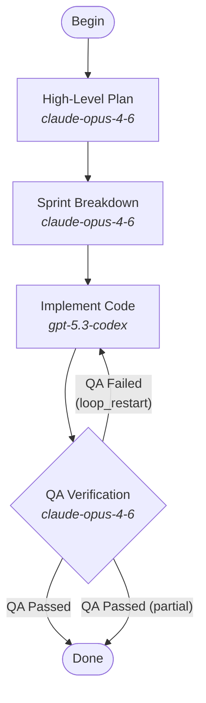

# Plan-Build-Verify Pipeline

The default development pipeline uses LLMs to plan, implement, and verify software projects in four stages.

## Pipeline Graph



## Stages

### 1. High-Level Plan — Claude Opus

Produces the architectural foundation for the entire project. Outputs:

- Requirements analysis
- Architecture overview and component breakdown
- Technical decisions (languages, frameworks, patterns)
- Implementation strategy with phased dependencies
- Risk assessment and mitigations
- Definition of done

### 2. Sprint Breakdown — Claude Opus

Decomposes the high-level plan into sprint-sized units of work. Each sprint defines:

- Sprint goal (one sentence)
- Scope (files, functions, APIs, tests)
- Inputs and outputs
- Acceptance criteria
- Dependencies on other sprints

No code is produced at this stage — purely planning.

### 3. Implement Code — Codex

Writes production-ready code following the sprint definitions. For each sprint:

- Clean, idiomatic code satisfying every acceptance criterion
- Unit tests for all public interfaces
- Architecture and patterns from the high-level plan
- Error handling at system boundaries

### 4. QA Verification — Claude Opus

Reviews the implementation against both the sprint plans and the high-level plan:

| Check | Description |
|-------|-------------|
| Sprint coverage | Every sprint's acceptance criteria are met |
| Architectural alignment | Code follows the high-level plan |
| Correctness | Logic is sound, edge cases handled |
| Completeness | No sprints skipped or partially implemented |
| Code quality | Readable, maintainable, properly tested |

**Pass** — pipeline exits successfully.
**Fail** — loops back to implementation with `loop_restart` (clears mutable context, preserves graph attributes, creates fresh run directory).

## Retry and Safety

- All four work nodes are **goal gates** — the pipeline cannot exit until each has succeeded or partially succeeded.
- Each node has `max_retries` configured (2-3 depending on the stage).
- Graph-level `fallback_retry_target` points to `sprint_breakdown` as a safety net if goal gates fail at exit.
- The QA failure loop back to `implement` uses `loop_restart=true`, which resets execution state so implementation starts clean with QA feedback in the outcome context.

## Usage

```go
runner := engine.NewRunner(registry)
outcome, err := runner.RunDefault(ctx, "/path/to/logs")
```

## Source

[`attractor/pipelines/plan_build_verify.dot`](pipelines/plan_build_verify.dot)
