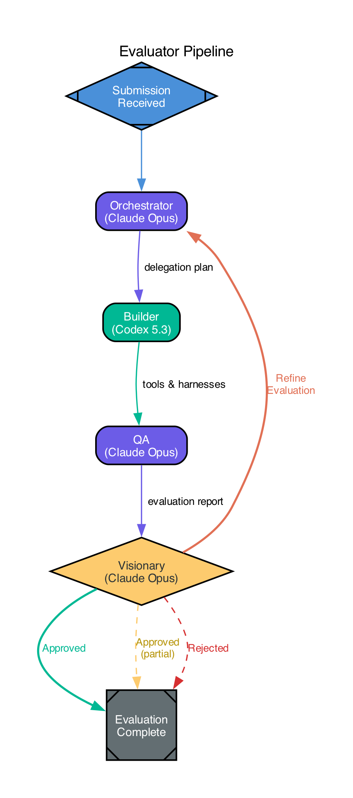

# Evaluator Pipeline

A four-stage pipeline that evaluates submissions against a project vision using role-separated AI agents. Rather than having a single LLM judge quality, the evaluator decomposes the problem: one agent plans the evaluation, another builds the testing tools, a third executes the tests, and a fourth judges the results against the original vision.

The visionary can loop back to the orchestrator when the evaluation itself was insufficient — wrong tools, missing checks, or unclear results — so the orchestrator can refine its delegation plan and re-run the builder and QA stages.



## Why this structure

Most AI evaluation approaches ask a single model to read code and decide if it's good. This fails for two reasons: the model has no way to actually run the code, and it conflates understanding the goal with measuring the result.

The evaluator pipeline solves both problems by separating concerns into four roles that mirror how human teams evaluate software — a lead who scopes the review, a developer who builds test infrastructure, a QA engineer who runs the tests, and a product owner who decides if the result matches the vision.

The feedback loop between the visionary and orchestrator adds a critical layer: the visionary doesn't just judge the submission, it also judges the evaluation. If the orchestrator asked the wrong questions, built the wrong tools, or missed critical dimensions, the visionary sends the orchestrator back to try again with specific guidance on what to fix. This prevents the pipeline from rejecting good work due to a bad evaluation, or approving bad work because the tests didn't cover what matters.

## Orchestration

`FactoryRunner` (`attractor/factory`) enforces the separation by running this pipeline as a **completely independent `RunDOT` call** with a fresh `state.Context`. The evaluator receives only `goal` and `last_response` from the developer — no planning notes, `status.*` keys, retry history, or internal state cross the boundary.

On rejection (visionary returns FAIL), FactoryRunner extracts the evaluator's `last_response` as `evaluator_feedback` and injects it into the developer's next iteration. This is the only data that crosses back.

The builder stage uses **Codex 5.3** (`gpt-5.3-codex`) for tool/harness construction. All other stages — orchestrator, QA, and visionary — use **Claude Opus** (`claude-opus-4-6`) for reasoning and judgment.

## Communication nodes

The evaluator pipeline includes two **communication nodes** (shape=`doubleoctagon`) that mark where it connects to the developer pipeline:

| Node | Direction | Purpose |
|------|-----------|---------|
| **receive_submission** | inbound | Entry point for developer output. In standalone mode, a pass-through from start. In the factory pipeline, the developer's QA-passed code enters here. |
| **return_feedback** | outbound | Exit point for rejection feedback. In standalone mode, flows through to exit. In the factory pipeline, rejection feedback routes back to the developer's implementation stage. |

These nodes are no-ops in standalone mode — they pass through immediately. When run via `FactoryRunner`, `receive_submission` receives the developer's output through `InitialContext`, and `return_feedback`'s presence in the final context (`status.return_feedback`) signals rejection to the FactoryRunner.

## Stages

### 1. Orchestrator (Claude Opus)

Receives the submission and the project vision. Produces a **delegation plan** with two sections:

- **Builder Tasks** — specific tools, test harnesses, scripts, and fixtures the builder must create. Each task has a clear purpose tied to an evaluation dimension (correctness, completeness, quality, vision alignment).
- **QA Checklist** — specific checks QA must perform using those tools, each tied to a success criterion from the vision.

On subsequent rounds (after visionary feedback), the orchestrator incorporates the visionary's concerns into a revised delegation plan. It prioritizes the visionary's feedback and avoids repeating evaluation approaches that failed to surface the right information.

The orchestrator is a goal gate (`goal_gate=true`), meaning the pipeline cannot exit successfully unless this stage succeeds. It has 2 retries on failure.

**Model:** `claude-opus-4-6` (Anthropic)

### 2. Builder (Codex 5.3)

A toolsmith that builds everything the QA stage needs. For each tool in the delegation plan, the builder produces:

- Runnable code that QA can invoke directly
- Usage instructions (CLI flags, env vars, expected I/O)
- Self-contained setup and teardown
- Structured output (JSON or parseable markers) for programmatic checking

The builder does not evaluate the submission — it only builds instruments. This is a goal gate with 3 retries, and its `retry_target` points back to itself so failures retry the build rather than restarting the whole pipeline.

**Model:** `gpt-5.3-codex` (OpenAI)

### 3. QA (Claude Opus)

Executes the builder's tools against the submission, following the orchestrator's checklist item by item. For each check:

1. Run the relevant tool or harness
2. Record raw output
3. Determine PASS or FAIL with justification
4. Note unexpected behavior even on passing checks

Produces a structured **evaluation report** with a summary (pass/fail counts, health assessment), per-check results (checklist item, tool used, outcome, evidence), and observations not covered by the checklist.

QA is deliberately objective — it reports what happened, not what it thinks should happen. Interpretation is the visionary's job.

**Model:** `claude-opus-4-6` (Anthropic)

### 4. Visionary (Claude Opus)

The keeper of the project's high-level goal. Reads the QA report and judges the submission against the vision on five dimensions:

1. **Vision alignment** — does the submission move the project toward its goal?
2. **Completeness** — are there gaps between delivery and vision?
3. **Quality bar** — does the work meet the standard the vision implies?
4. **Regression** — does the submission break anything that previously worked?
5. **Evaluation quality** — was the evaluation itself sufficient? Did the QA checklist and tools actually test the right things?

This is a conditional gate (diamond shape) with four outcomes:

| Outcome | Condition | What happens |
|---------|-----------|--------------|
| **Approved** | `outcome=success` | Submission satisfies the vision. Pipeline exits with success summary. |
| **Approved (partial)** | `outcome=partial_success` | Submission is acceptable with caveats noted. |
| **Refine Evaluation** | `outcome=retry` | The evaluation was insufficient. Visionary sends feedback to the orchestrator, which refines the delegation plan and re-runs builder + QA. |
| **Rejected** | `outcome=fail` | Submission falls short and the evaluation was thorough. Structured feedback is returned to the submitter. |

The distinction between "refine evaluation" and "rejected" is important: RETRY means the visionary can't confidently judge because the evaluation didn't test the right things. FAIL means the evaluation was thorough and the submission genuinely falls short.

**Model:** `claude-opus-4-6` (Anthropic)

## The feedback loop

When the visionary returns RETRY, it provides specific feedback for the orchestrator:

1. What the evaluation failed to cover or got wrong
2. What dimensions the orchestrator should focus on in the next round
3. Specific tools or checks that should be added, changed, or removed

The orchestrator receives this feedback in context and produces a revised delegation plan that addresses every issue the visionary raised. The builder then constructs new or modified tools, QA re-runs the evaluation, and the visionary judges again.

This loop continues until the visionary is satisfied that the evaluation is thorough enough to make a judgment — at which point it either approves or rejects the submission. The `default_max_retry` of 3 caps the total number of refinement rounds.

```
                              ┌──────────────────────────────────────────┐
                              │          Refine Evaluation                │
                              │    (evaluation was insufficient)          │
                              ▼                                          │
Start ──► [Receive] ──► Orchestrator ──► Builder ──► QA ──► Visionary ──┤
                                                                        ├──► Approved
                                                                        ├──► Approved (partial)
                                                                        └──► [Return Feedback] ──► Exit
```

`[Receive]` and `[Return Feedback]` are communication nodes (doubleoctagon). In standalone mode they are pass-throughs. In the factory pipeline they connect to the developer pipeline.

## Configuration

| Attribute | Value | Purpose |
|-----------|-------|---------|
| `default_max_retry` | 3 | Global retry ceiling for any stage (including refinement loops) |
| `fallback_retry_target` | `builder` | If a stage fails with no retry target, restart from the builder |
| `reasoning_effort` | high (via stylesheet) | All stages use high reasoning effort |

## Goal gates

All four working stages (orchestrator, builder, QA, visionary) are goal gates. The pipeline cannot exit successfully unless every stage has a success or partial success outcome. If any gate is unsatisfied when the pipeline reaches the exit node, the engine routes to the `retry_target` (or `fallback_retry_target`) instead of exiting.

## When to use this pipeline

- **Pull request review** — evaluate code changes against a feature spec or architectural vision
- **Agent output validation** — verify that an AI coding agent's output matches the original task description
- **Continuous evaluation** — run as part of a CI/CD pipeline to gate deployments against quality criteria
- **Spec compliance** — check an implementation against a specification document
